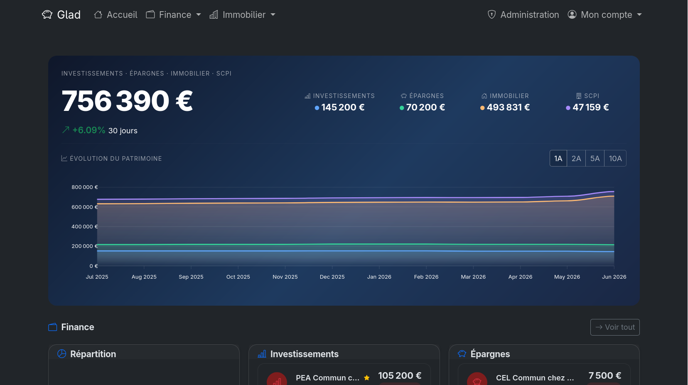
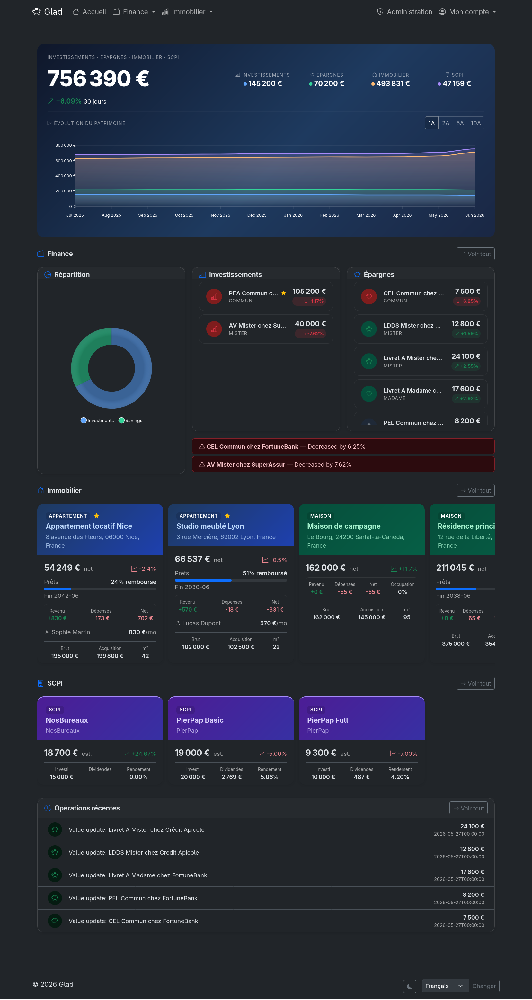
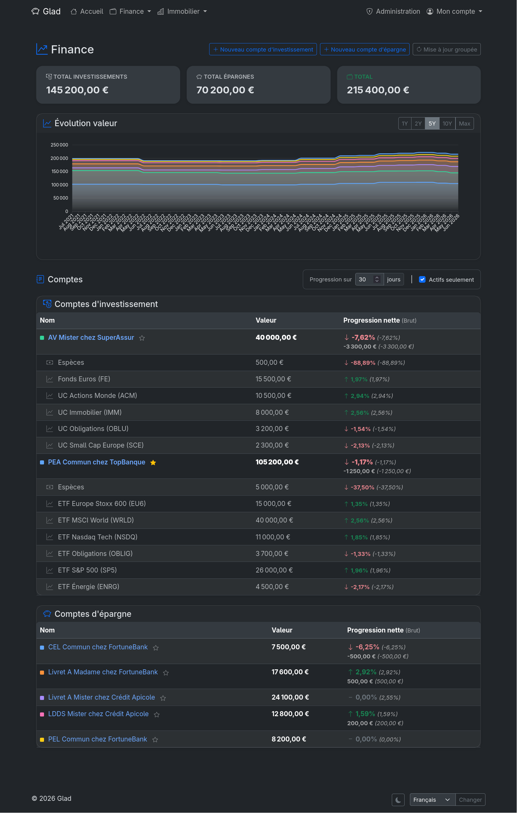
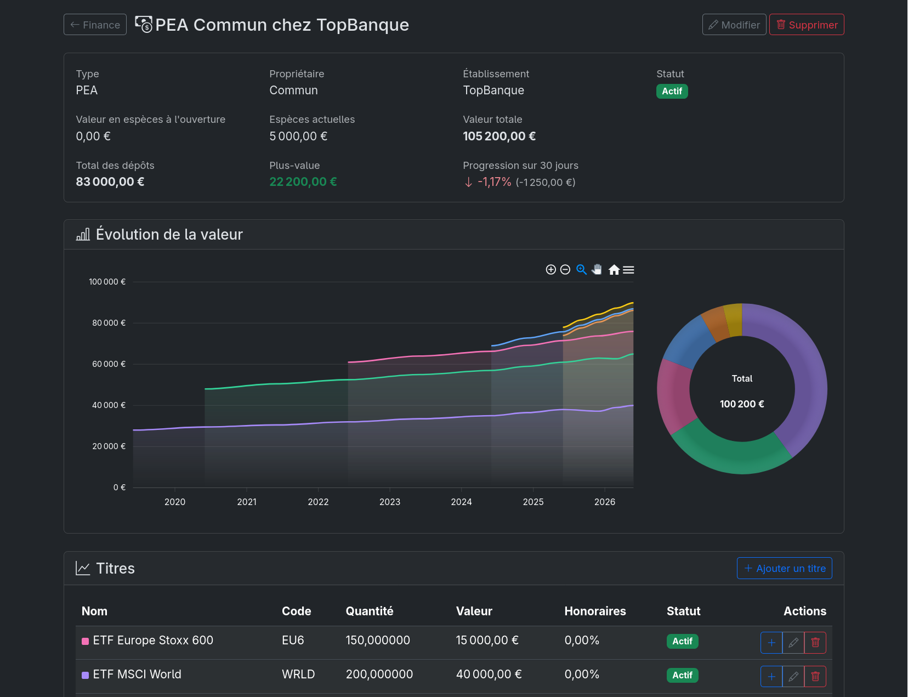
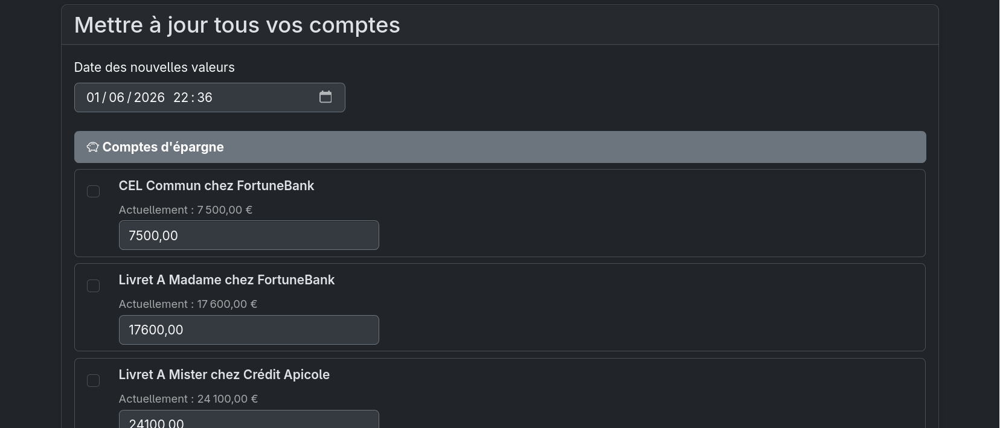
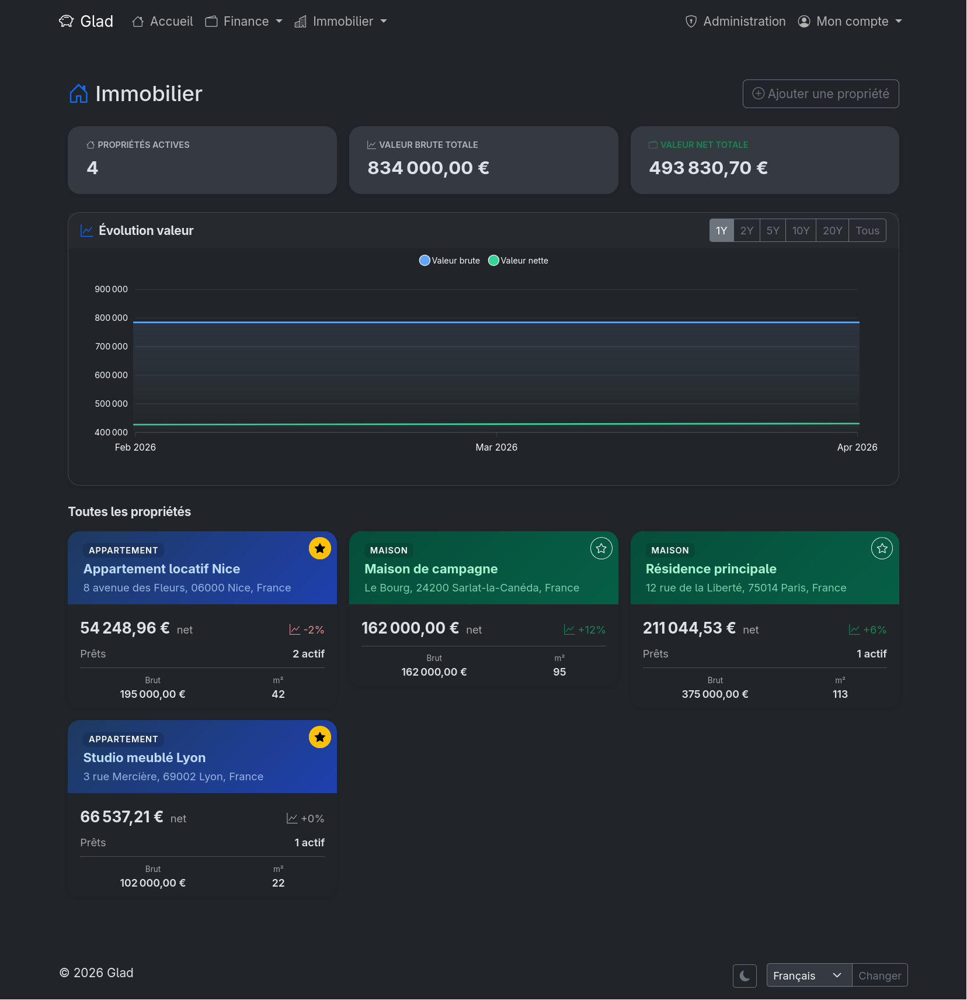
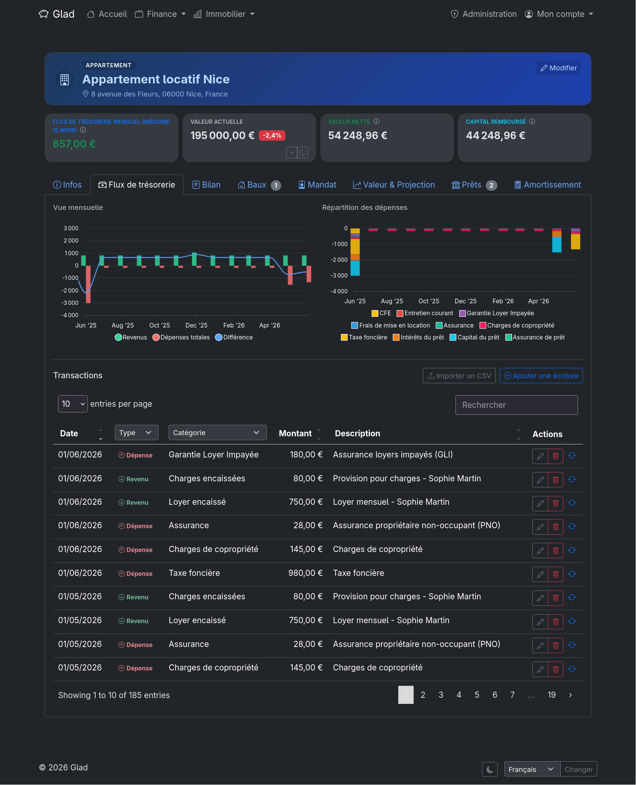
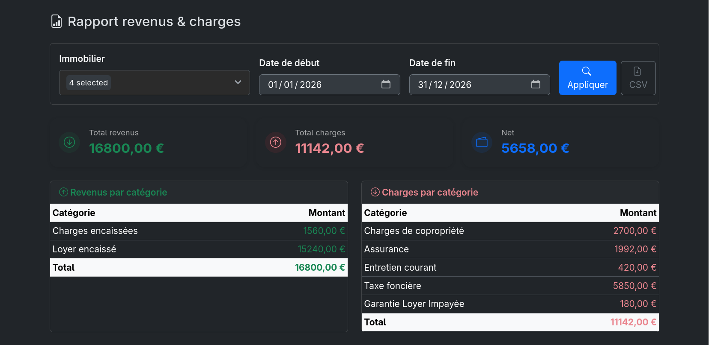
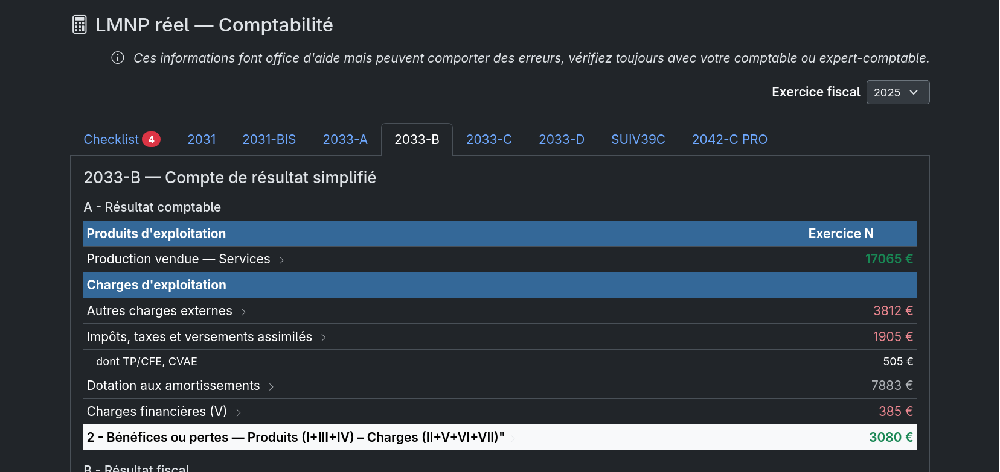
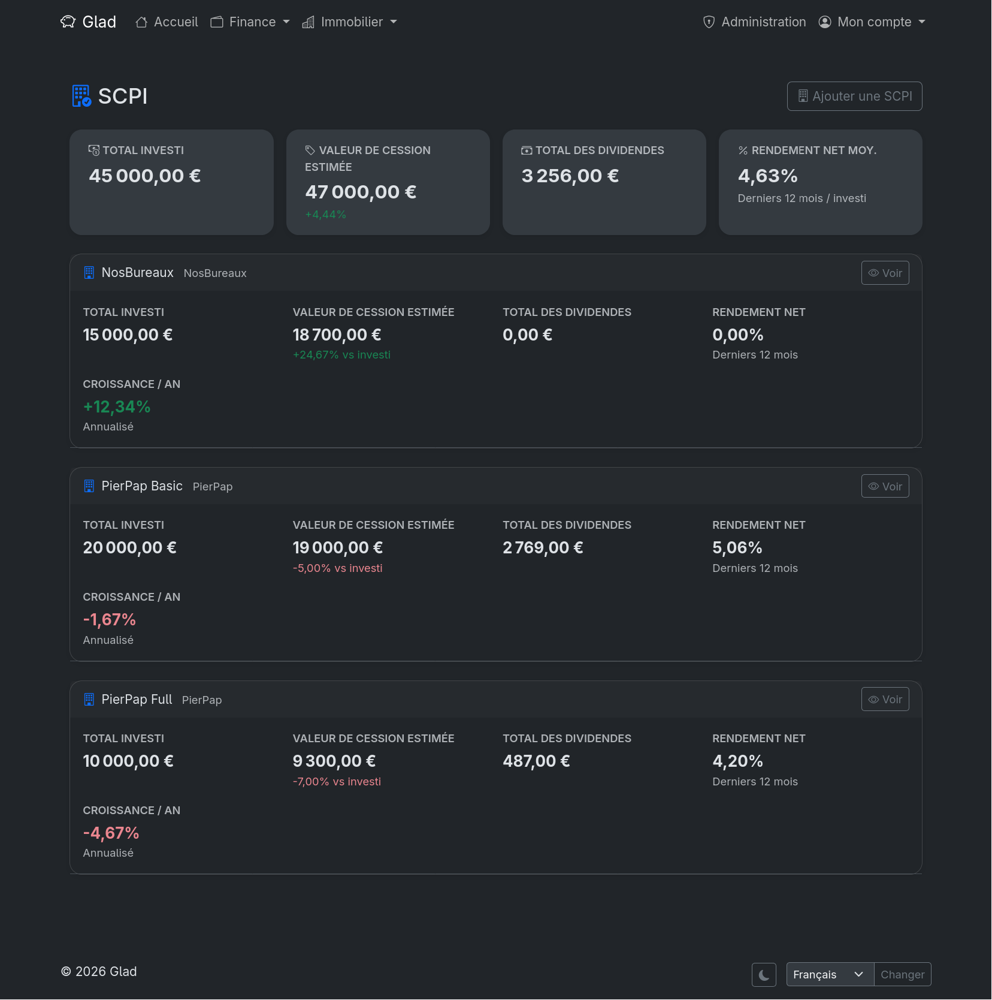

# Glad

[](https://github.com/Aohzan/glad/actions/workflows/docker-publish.yml) 

:uk: Glad is a web app to follow its investments and properties, principally based on financial and properties in France (glad come from Breton).

:fr: Glad est une application web pour suivre ses investissements et propriétés, principalement basés sur les finances et propriétés en France (glad vient du breton).



## Features

### Finance

- **Savings accounts** — track values, interest rates, deposits, and historical progression
- **Investment accounts** — manage cash and security holdings with price history and valuation charts
- Portfolio dashboard with gain/loss tracking across all accounts
- Batch update to easily update prices and valuations for multiple accounts at once
- CSV import/export for bulk data entry

### Properties

- **Property management** — purchase price, fees (notary, agency, credit), valuation history, co-ownership share
- **Loans** — multiple loans per property with amortization schedules; supports standard and smoothed loans (prêt lisseur)
- **Leases & tenants** — furnished/empty/commercial leases, rent, charges, security deposit, recurring entries
- **Ledger** — categorized income and expense entries (rent, management fees, works, insurance, property tax, etc.) with recurring support and CSV import
- **Management mandates** — track property managers with fee structures
- **Financial reporting** — monthly balance sheets, accounting dashboard, income/expense summaries with deductible breakdown
- **LMNP** (*beta*) — accounting support
- **SCPI** — track SCPI shares with valuation and dividend history

### Web application

- Multi-language support (English and French)
- Multi-currency support
- Dark mode
- Responsive design
- Passwordless authentication with passkeys (WebAuthn)

## Screenshots

| | | |
|---|---|---|
| [](docs/images/dashboard.png) | [](docs/images/finance_home.png) | [](docs/images/finance_invest.png) |
| Dashboard | Finance home | Finance investments |
| [](docs/images/finance_batch_update.png) | [](docs/images/property_home.png) | [](docs/images/property_details.png) |
| Finance batch update | Property home | Property details |
| [](docs/images/property_accounting.png) | [](docs/images/property_lmnp.png) | [](docs/images/scpi.png) |
| Property accounting | Property LMNP | SCPI |

## Configuration

### Docker Compose

```yaml
services:
  glad:
    image: ghcr.io/aohzan/glad:latest
    container_name: glad
    restart: unless-stopped
    ports:
      - 8000:8000
    volumes:
      - /opt/glad:/app/data
    environment:
      SECRET_KEY: "change-me-to-a-long-random-string"
      APP_URL: "https://glad.my.domain"
      ALLOWED_HOSTS: "glad.my.domain,127.0.0.1"
```

### Environment variables

| Variable                | Required    | Default                | Description                                                              |
| ----------------------- | ----------- | ---------------------- | ------------------------------------------------------------------------ |
| `SECRET_KEY`            | Yes         | —                      | Django secret key — keep it private                                      |
| `APP_URL`               | Yes         | —                      | Canonical public URL (e.g. `https://glad.my.domain`)                     |
| `ALLOWED_HOSTS`         | Yes         | —                      | Comma-separated list of allowed hostnames                                |
| `CSRF_COOKIE_SECURE`    | Recommended | `false`                | Set to `true` when serving over HTTPS                                    |
| `SESSION_COOKIE_SECURE` | Recommended | `false`                | Set to `true` when serving over HTTPS                                    |
| `CORS_ALLOWED_ORIGINS`  | No          | derived from `APP_URL` | Comma-separated list of allowed CORS origins                             |
| `CSRF_TRUSTED_ORIGINS`  | No          | derived from `APP_URL` | Comma-separated list of trusted origins for CSRF                         |
| `DEFAULT_LANGUAGE`      | No          | `fr`                   | Default UI language (`fr` or `en`)                                       |
| `WEBAUTHN_ORIGIN`       | No          | derived from `APP_URL` | Override the WebAuthn origin (passkey authentication)                    |
| `WEBAUTHN_RP_ID`        | No          | derived from `APP_URL` | Override the WebAuthn relying party ID                                   |
| `SUB_PATH`              | No          | —                      | URL sub-path prefix if the app is served under a sub-path (e.g. `/glad`) |
| `DEBUG`                 | No          | `false`                | Set to `true` for development only                                       |
| `DB`                    | No          | SQLite                 | Set to `postgres` to use PostgreSQL                                      |
| `DB_NAME`               | No          | —                      | PostgreSQL database name                                                 |
| `DB_USER`               | No          | —                      | PostgreSQL user                                                          |
| `DB_PASSWORD`           | No          | —                      | PostgreSQL password                                                      |
| `DB_HOST`               | No          | —                      | PostgreSQL host                                                          |
| `DB_PORT`               | No          | `5432`                 | PostgreSQL port                                                          |

### Database

Glad uses SQLite by default. PostgreSQL is also supported — see [Database Configuration](docs/database.md) for details.

## License

This project is licensed under the GNU GPLv3 License - see the LICENSE file for details.
