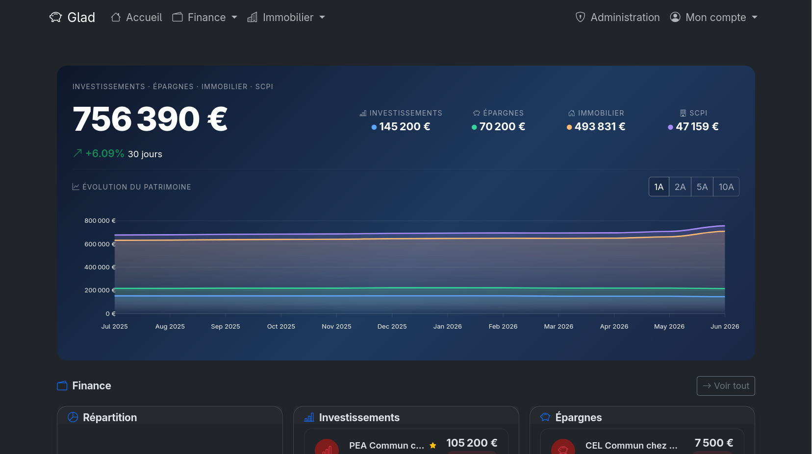
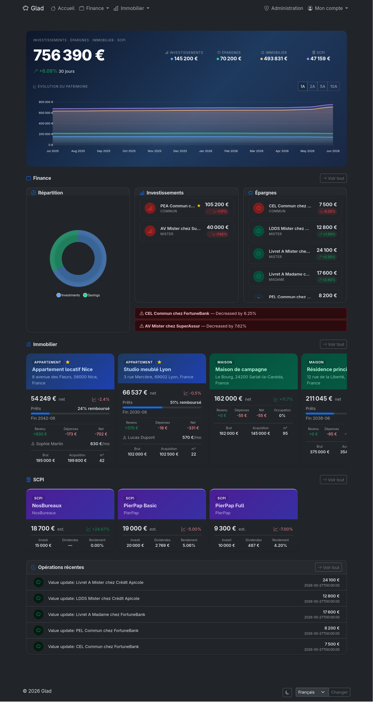
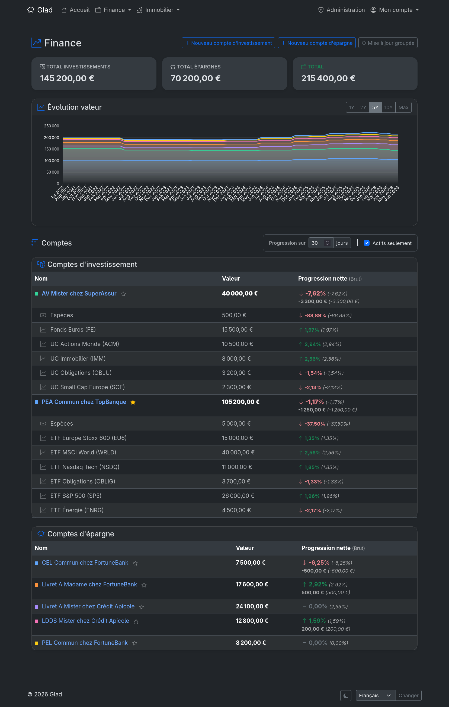
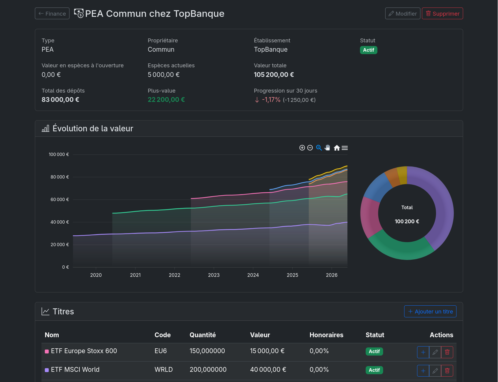
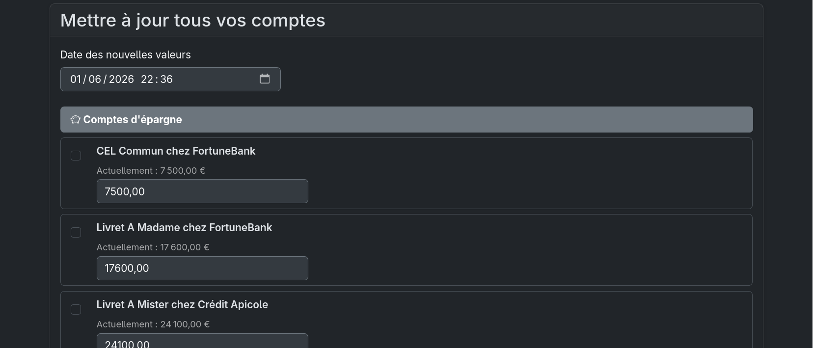
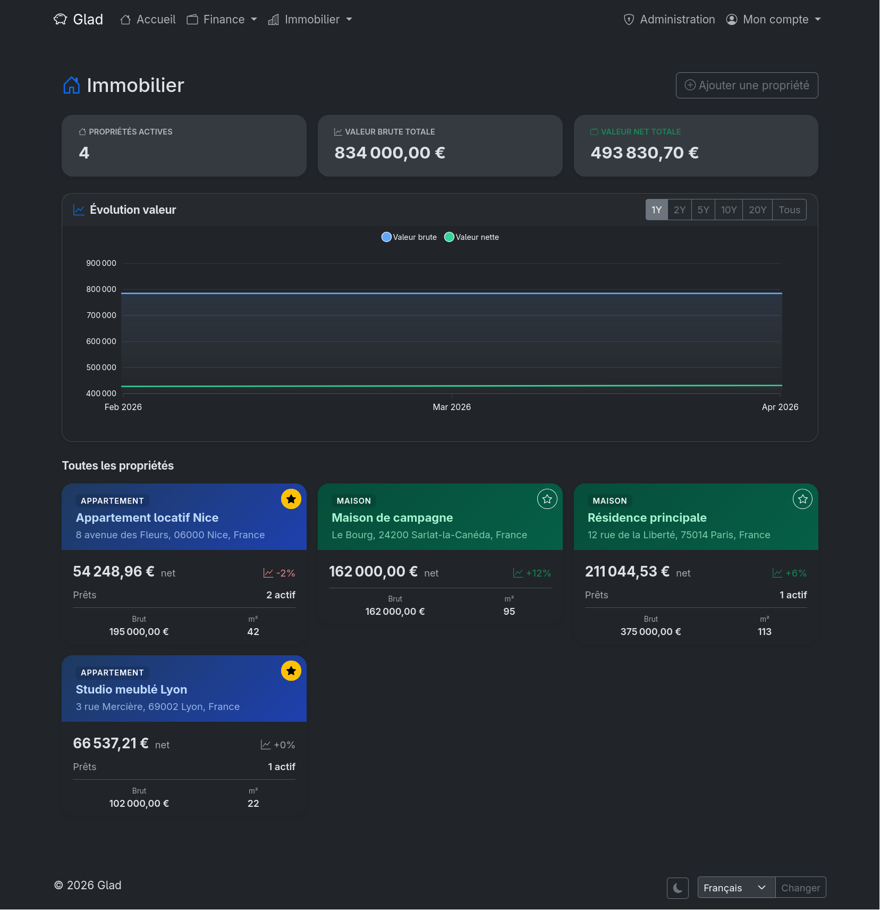
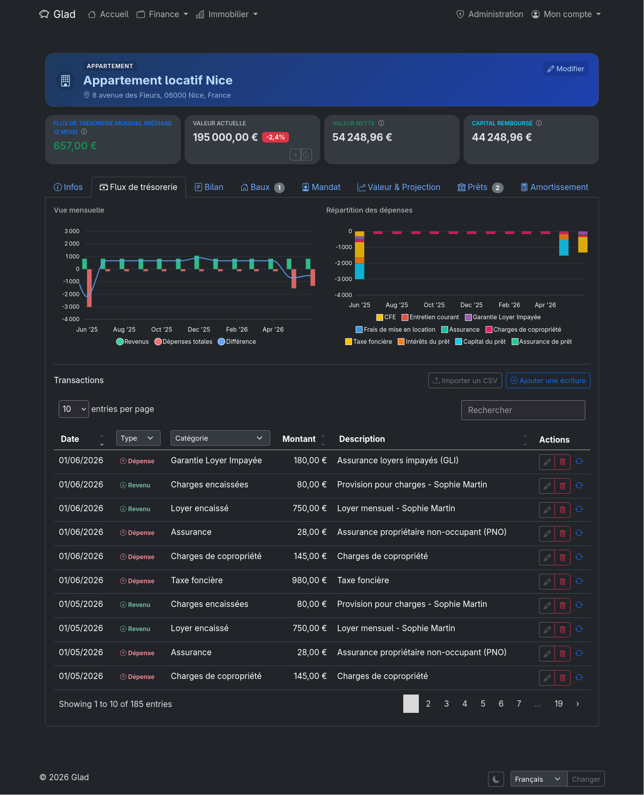
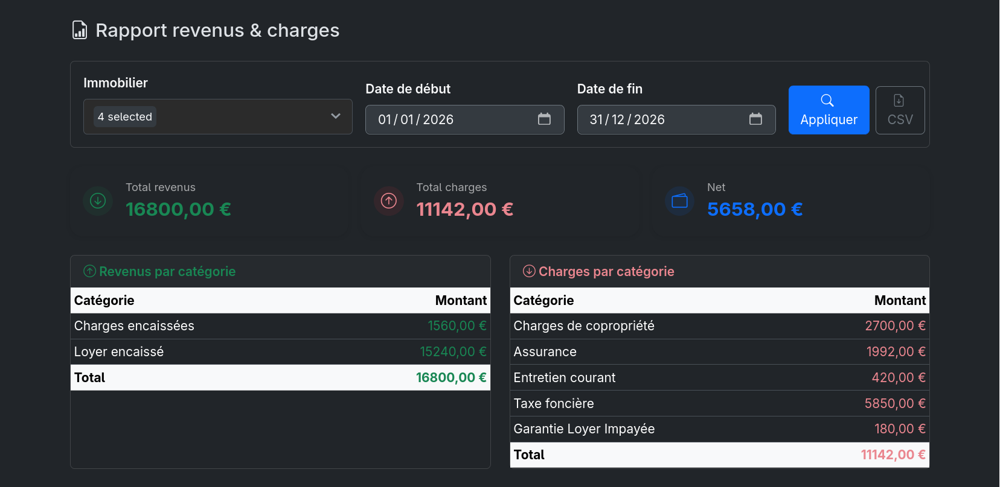
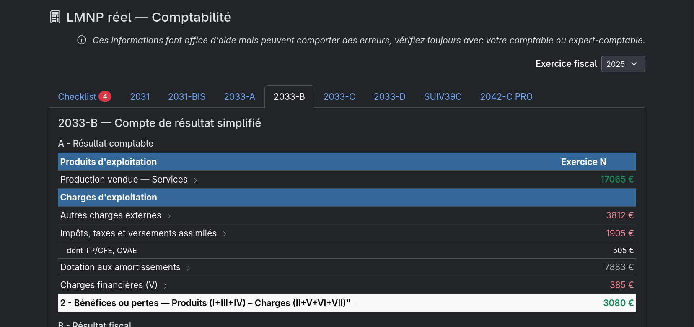
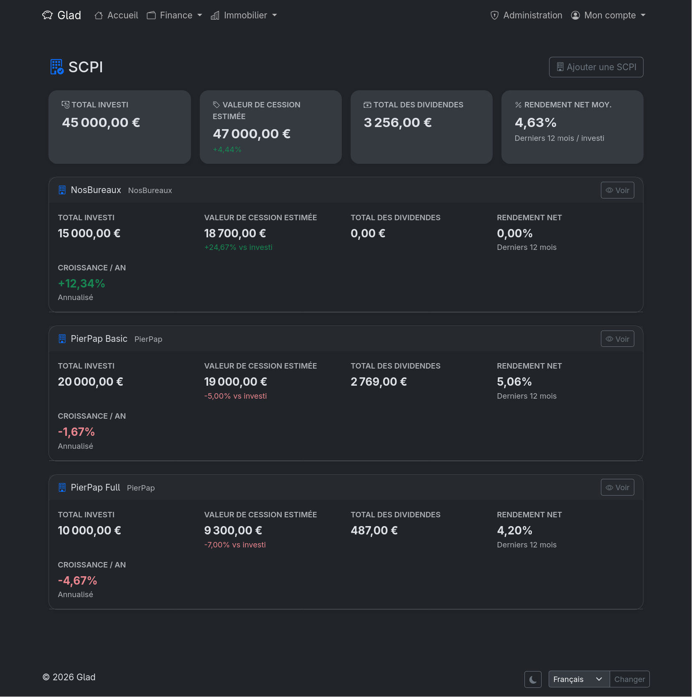

# Glad

[](https://github.com/Aohzan/glad/actions/workflows/ci.yml) [](https://github.com/Aohzan/glad/actions/workflows/docker-publish.yml)  [](LICENSE.md)

:uk: Glad is a web app to follow its investments and properties, principally based on financial and properties in France (glad come from Breton).

:fr: Glad est une application web pour suivre ses investissements et propriétés, principalement basés sur les finances et propriétés en France (glad vient du breton).



## Features

### Finance

- **Savings accounts** — track values, interest rates, deposits, and historical progression
- **Investment accounts** — manage cash and security holdings with price history and valuation charts
- Portfolio dashboard with gain/loss tracking across all accounts
- Batch update to easily update prices and valuations for multiple accounts at once
- CSV import/export for bulk data entry

### Properties

- **Property management** — purchase price, fees (notary, agency, credit), valuation history, co-ownership share
- **Loans** — multiple loans per property with amortization schedules; supports standard and smoothed loans (prêt lisseur)
- **Leases & tenants** — furnished/empty/commercial leases, rent, charges, security deposit, recurring entries
- **Ledger** — categorized income and expense entries (rent, management fees, works, insurance, property tax, etc.) with recurring support and CSV import
- **Management mandates** — track property managers with fee structures
- **Financial reporting** — monthly balance sheets, accounting dashboard, income/expense summaries with deductible breakdown
- **LMNP** (*beta*) — accounting support
- **SCPI** — track SCPI shares with valuation and dividend history

### Web application

- Multi-language support (English and French)
- Multi-currency support
- Dark mode
- Responsive design
- Passwordless authentication with passkeys (WebAuthn)

## Screenshots

| | | |
|---|---|---|
| [](docs/images/dashboard.png) | [](docs/images/finance_home.png) | [](docs/images/finance_invest.png) |
| Dashboard | Finance home | Finance investments |
| [](docs/images/finance_batch_update.png) | [](docs/images/property_home.png) | [](docs/images/property_details.png) |
| Finance batch update | Property home | Property details |
| [](docs/images/property_accounting.png) | [](docs/images/property_lmnp.png) | [](docs/images/scpi.png) |
| Property accounting | Property LMNP | SCPI |

## Configuration

### Docker Compose

```yaml
services:
  glad:
    image: ghcr.io/aohzan/glad:latest
    container_name: glad
    restart: unless-stopped
    ports:
      - 8000:8000
    volumes:
      - /opt/glad:/app/data
    environment:
      SECRET_KEY: "change-me-to-a-long-random-string"
      APP_URL: "https://glad.my.domain"
```

The image runs the application as an unprivileged user (`glad`, UID 1000). On start it takes ownership of `/app/data` if needed, so volumes created by older versions keep working. The container exposes port 8000, answers health checks on `/health`, and the `latest` tag always points to the latest release. Images are published for `linux/amd64` and `linux/arm64`.

Generate a secret key with:

```shell
python -c "from django.core.management.utils import get_random_secret_key; print(get_random_secret_key())"
```

### Environment variables

When `APP_URL` uses `https`, the secure defaults below (SSL redirect, secure cookies, HSTS, proxy SSL header) are enabled automatically.

| Variable                | Required    | Default                 | Description                                                                      |
| ----------------------- | ----------- | ----------------------- | -------------------------------------------------------------------------------- |
| `SECRET_KEY`            | Yes         | —                       | Django secret key — the app refuses to start without it                          |
| `APP_URL`               | Yes         | —                       | Canonical public URL (e.g. `https://glad.my.domain`)                             |
| `ALLOWED_HOSTS`         | No          | hostname of `APP_URL`   | Comma-separated list of allowed hostnames                                        |
| `CSRF_TRUSTED_ORIGINS`  | No          | `APP_URL`               | Comma-separated list of trusted origins for CSRF                                 |
| `SECURE_SSL_REDIRECT`   | No          | `true` if `APP_URL` is https | Redirect plain HTTP requests to HTTPS (`/health` is exempt)                 |
| `SESSION_COOKIE_SECURE` | No          | `true` if `APP_URL` is https | Send the session cookie over HTTPS only                                     |
| `CSRF_COOKIE_SECURE`    | No          | `true` if `APP_URL` is https | Send the CSRF cookie over HTTPS only                                        |
| `SESSION_COOKIE_AGE`    | No          | `28800` (8 hours)       | Session lifetime in seconds, reset on every request                              |
| `DEFAULT_LANGUAGE`      | No          | `fr`                    | Default UI language (`fr` or `en`)                                               |
| `WEBAUTHN_ORIGIN`       | No          | `APP_URL`               | Override the WebAuthn origin (passkey authentication)                            |
| `WEBAUTHN_RP_ID`        | No          | hostname of `APP_URL`   | Override the WebAuthn relying party ID                                           |
| `SUB_PATH`              | No          | —                       | URL sub-path prefix if the app is served under a sub-path (e.g. `/glad`)         |
| `UVICORN_OPTIONS`       | No          | —                       | Extra options for the ASGI server (e.g. `--proxy-headers --forwarded-allow-ips='*'`) |
| `ENVIRONMENT`           | No          | `production`            | `development` or `production`, used for warnings only                            |
| `DEBUG`                 | No          | `false`                 | Set to `true` for development only                                               |
| `DB`                    | No          | SQLite                  | Set to `postgres` to use PostgreSQL                                              |
| `DB_NAME`               | No          | —                       | PostgreSQL database name                                                         |
| `DB_USER`               | No          | —                       | PostgreSQL user                                                                  |
| `DB_PASSWORD`           | No          | —                       | PostgreSQL password                                                              |
| `DB_HOST`               | No          | —                       | PostgreSQL host                                                                  |
| `DB_PORT`               | No          | `5432`                  | PostgreSQL port                                                                  |
| `DB_SSL_MODE`           | No          | `prefer`                | PostgreSQL `sslmode` (`disable`, `prefer`, `require`, `verify-full`, ...)        |
| `DB_CONN_MAX_AGE`       | No          | `600`                   | PostgreSQL persistent connection lifetime in seconds (`0` to disable)            |
| `EMAIL_HOST`            | No          | —                       | SMTP host; when empty, emails are printed to the console                         |
| `EMAIL_PORT`            | No          | `587`                   | SMTP port (`465` enables SSL, `587` enables TLS by default)                      |
| `EMAIL_HOST_USER`       | No          | —                       | SMTP user                                                                        |
| `EMAIL_HOST_PASSWORD`   | No          | —                       | SMTP password                                                                    |
| `EMAIL_USE_TLS`         | No          | derived from port       | Force STARTTLS on or off                                                         |
| `EMAIL_USE_SSL`         | No          | derived from port       | Force implicit SSL on or off                                                     |
| `EMAIL_TIMEOUT`         | No          | `10`                    | SMTP timeout in seconds                                                          |
| `DEFAULT_FROM_EMAIL`    | No          | `Glad <glad@localhost>` | Sender address for notifications                                                 |
| `EMAIL_SUBJECT_PREFIX`  | No          | `[Glad] `               | Prefix of email subjects                                                         |

### Database

Glad uses SQLite by default. PostgreSQL is also supported — see [Database Configuration](docs/database.md) for details.

## Development

```shell
uv sync --dev          # Python dependencies
npm ci                 # front-end vendors into static/vendors/
uv run pre-commit install
ENV_FILE=.env.dev uv run manage.py migrate
ENV_FILE=.env.dev uv run manage.py runserver
ENV_FILE=.env.dev uv run pytest --cov
```

Releases are cut automatically by [python-semantic-release](https://python-semantic-release.readthedocs.io/) from [conventional commits](https://www.conventionalcommits.org/) pushed to `main` (`beta` produces pre-releases). Each release publishes a GitHub release, a changelog entry and a Docker image.

## Security

See [SECURITY.md](SECURITY.md) to report a vulnerability.

## License

This project is licensed under the GNU GPLv3 License - see the LICENSE file for details.
